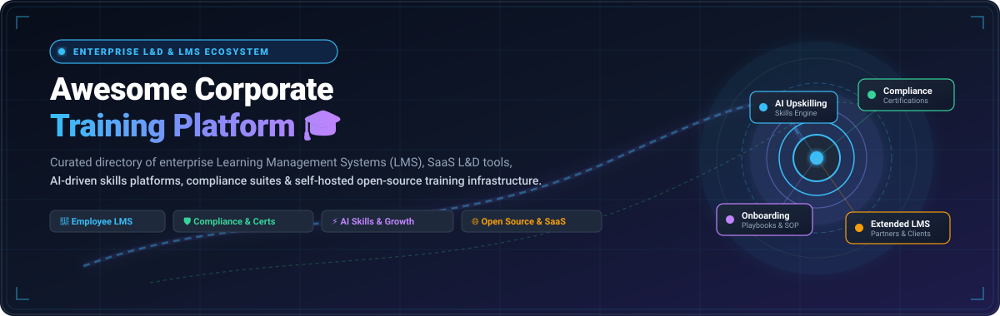

  

  
  
  
  
  
  
  

---

# 🎓 Awesome Corporate Training Platform

> **A curated directory of top SaaS platforms and open-source Learning Management Systems (LMS) for enterprise workforce training, employee onboarding, compliance tracking, AI-powered skills development, and extended enterprise learning.** 🚀

**Last updated: August 2026** 📅

This repository tracks notable **SaaS platforms** and **open-source projects** for **Corporate Training Platforms & Enterprise LMS ecosystems**. These tools help organizations deliver, track, and manage employee training, onboarding pipelines, regulatory compliance certifications, role-based skills development, collaborative learning hubs, and extended-enterprise (partner/customer) education at scale. 🏢✨

---

## 📑 Table of Contents

- [☁️ SaaS / Hosted Platforms](#️-saas--hosted-platforms)
- [💻 Open-Source GitHub Projects](#-open-source-github-projects)
- [🛠️ Extended Tooling & Frameworks](#️-extended-tooling--frameworks)
- [🤝 How to Contribute](#-how-to-contribute)
- [⭐ Star History](#-star-history)
- [⚖️ Disclaimer](#️-disclaimer)

---

## ☁️ SaaS / Hosted Platforms

Below is a curated comparison of leading commercial corporate LMS and enablement platforms, **sorted in descending order by company scale / valuation / revenue**. 📊

| Platform | Description & Key Strengths | Company Scale / Valuation (Est.) 🏢 | Pricing (Starting Tier) 💳 | Free Tier / Free Trial Limits 🎁 |
| :--- | :--- | :--- | :--- | :--- |
| **[Cornerstone OnDemand](https://www.cornerstoneondemand.com/)** | Large-scale enterprise talent and learning management suite for global compliance, skills intelligence, and workforce development. 🌐 | **$5.2 Billion** Valuation (Clearlake Capital / ~$850M+ ARR) | **$6 – $8 / user / month** (PEPM for Learning module; annual contracts from ~$20,000/year) | **14-day pilot sandbox** upon enterprise scoping (Access to enterprise LMS module, skills matrix demo, and compliance workflows; no free-forever tier) |
| **[Bridge LMS](https://www.getbridge.com/)** (Instructure) | Corporate learning platform combining LMS training, performance 1-on-1s, coaching, and skills mapping. 🌉 | **$4.8 Billion** Parent Valuation (Instructure / KKR; ~$150M unit scale) | **$3 – $4 / user / month** (Learn core LMS tier; annual contract minimums typically starting at ~$12,500/year) | **14-day evaluation sandbox** upon demo request (Access to core LMS course catalog, authoring, and employee check-ins; no free-forever tier) |
| **[Lessonly by Seismic](https://www.lessonly.com/)** | Enablement-focused training platform strong in sales and customer-facing team training with practice, simulation, and coaching features. 🎯 | **$3.0 Billion** Valuation (Seismic parent / ~$400M ARR) | **$300 – $500 / month** (Starting tier for small teams; enterprise annual plans from ~$10,000/year) | **14-day proof-of-concept trial** upon sales qualification (Access to lesson authoring, scenario practice, and grading workflows; no free-forever tier) |
| **[Northpass](https://www.northpass.com/)** | Customer and employee training platform with strong content delivery, academy branding, and engagement features. 🧭 | **$1.1 Billion** Parent Valuation (Gainsight / Vista Equity Partners) | **$200 / month** (Essentials starting tier for small deployments; mid-market packages from ~$15,000/year) | **14-day free trial / sandbox** upon demo request (Access to academy branding, course builder, and quiz workflows; no free-forever tier) |
| **[Docebo](https://www.docebo.com/)** | Enterprise AI-powered LMS with strong content management, personalization, extended enterprise capabilities, and advanced analytics. 🤖 | **$580 Million** Market Cap (NASDAQ: DCBO / ~$275M Annual Revenue) | **$5 – $10 / active user / month** (Annual contracts starting at ~$25,000/year for ~300+ monthly active users) | **14-day evaluation sandbox** upon demo request (Full feature access to AI course builder, demo content, and analytics; no free-forever tier) |
| **[SAP Litmos](https://www.litmos.com/)** | Global enterprise LMS with rapid deployment, built-in course authoring, and pre-packaged corporate compliance content collections. ⚡ | **$500 Million – $1.0 Billion** Valuation (Francisco Partners / ~$100M+ ARR) | **$3 – $6 / user / month** (Foundation LMS tier for up to 500 users; LMS + Content bundles from $9–$15/user/mo) | **14-day free trial** (Full access to LMS interface, AI authoring tools, sample course catalog, no credit card required) |
| **[Absorb LMS](https://www.absorblms.com/)** | Modern, user-friendly corporate LMS known for clean UX, strong compliance and certification tracking, and AI-assisted features. 🛡️ | **$500+ Million** Valuation (WCAS / ~$80M+ ARR) | **$800 / month base** (or ~$14,500/year starting package for up to 500 active learners; ~$16/active learner) | **14-day free trial / sandbox** upon request (Access to course creation, compliance workflows, and reporting engine; no free-forever tier) |
| **[360Learning](https://360learning.com/)** | Collaborative corporate learning platform emphasizing peer-authored content, skills-based learning paths, and social learning for modern L&D teams. 👥 | **$400 – $500 Million** Valuation ($240M+ Funding / ~$55M ARR) | **$8 / user / month** (Team plan, up to 100 users) | **30-day free trial** (Full access to Team plan features, AI authoring, SCORM, up to 100 users, no credit card required) |
| **[WorkRamp](https://www.workramp.com/)** | Enablement and training platform oriented toward revenue teams, customer education academies, and employee upskilling. 📈 | **$200 Million** Valuation ($67M+ Funding / Learning Pool) | **$5 – $9 / user / month** (Starting tiers; annual platform commitments typically from ~$10,000–$15,000/year) | **14-day proof-of-concept sandbox** upon qualification (Access to course creator, single-academy portal, and certification tracks; no free-forever tier) |
| **[LearnUpon](https://www.learnupon.com/)** | Highly rated LMS focused on ease of use, multi-portal architecture, and strong support for both employee and customer training. 🌟 | **$200 Million** Valuation ($56M+ Funding / Summit Partners) | **$6 – $9 / active user / month** (Essential plan starting at ~$15,000/year for up to 150 active learners) | **14-day evaluation sandbox** upon sales consultation (Access to multi-portal setup, course builder, and SCORM testing; no free-forever tier) |
| **[Trainual](https://trainual.com/)** | Process and training documentation platform popular with growing companies for building playbooks, SOPs, and onboarding programs. 📖 | **$120 – $150 Million** Valuation ($34M+ Funding / ~$20M ARR) | **$249 / month** (Small Business/Core plan, includes first 10 seats; +$12–$15/seat/mo for additional users) | **7-day free trial** (Full access to create SOPs, build training playbooks, and invite team members, no credit card required) |
| **[TalentLMS](https://www.talentlms.com/)** | Popular mid-market and SMB-friendly LMS with fast setup, SCORM/xAPI support, gamification, and affordable per-user pricing. 🏆 | **$100 – $150 Million** Valuation (Epignosis / ~$25M+ ARR) | **$89 / month** (Starter/Core plan billed annually for up to 40 users; or $119/mo billed monthly) | **Free Forever Plan**: Up to **5 active users** and **10 courses** (unlimited email support, standard features, no expiration, no credit card required) |

---

## 💻 Open-Source GitHub Projects

Corporate training has one of the strongest open-source software ecosystems. These mature, self-hostable LMS platforms eliminate recurring per-seat licensing fees while giving organizations complete control over employee data, compliance records, and UI customization. 🔓📦

The projects below are **sorted in descending order by GitHub star count** with real-time shields.io star badges linking to each repository's stargazers. ⭐

1. **[BigBlueButton](https://github.com/bigbluebutton/bigbluebutton)**   
   📹 Open-source web conferencing and virtual classroom system designed explicitly for live corporate seminars, employee webinars, and instructor-led training. Features real-time multi-user whiteboard, breakout rooms, screen sharing, polling, and seamless integration with major LMS cores (Moodle, Canvas, Sakai).

2. **[Moodle](https://github.com/moodle/moodle)**   
   🌍 The world’s most widely deployed open-source LMS (GPL). Extremely flexible with an ecosystem of 2,000+ community plugins, native SCORM/xAPI compliance, competency frameworks, badge certifications, and proven enterprise scalability for compliance and onboarding.

3. **[Canvas LMS (Community Edition)](https://github.com/instructure/canvas-lms)**   
   🎨 Modern, intuitive open-source LMS (AGPLv3) by Instructure. Features a clean Ruby on Rails backend, rich REST APIs, LTI standards support, customizable grading rubrics, and modular corporate training adaptability for companies valuing sleek usability.

4. **[Open edX Platform](https://github.com/openedx/edx-platform)**   
   🏛️ Scalable, enterprise-grade open-source learning platform originally engineered by Harvard and MIT. Excels in delivering large-cohort training, self-paced certification tracks, rich video learning pathways, and complex multi-course corporate curricula.

5. **[Frappe LMS](https://github.com/frappe/lms)**   
   🚀 Modern, 100% open-source LMS built on the Python/JS Frappe framework. Provides an ultra-clean UI, intuitive course builder, assessment engine, job board integration, and seamless native connectivity to ERPNext and HRIS workflows.

6. **[Tutor for Open edX](https://github.com/overhangio/tutor)**   
   🐳 The official Docker and Kubernetes-based distribution and orchestration tool for Open edX. Simplifies enterprise deployment, maintenance, theme customization, and automated scaling from single servers to multi-cluster cloud environments.

7. **[Chamilo LMS](https://github.com/chamilo/chamilo-lms)**   
   ⚡ Lightweight, user-friendly open-source LMS (GNU/GPL) focused on simplicity, speed, and high learner engagement. Well-suited for SMB employee training, skill tracking, timed certifications, and standard SCORM course playback.

8. **[Sensei LMS](https://github.com/Automattic/sensei)**   
   🧩 Open-source modular WordPress learning management plugin developed by Automattic. Turns any WordPress instance into an interactive corporate training portal with lesson modules, quizzes, course prerequisites, and WooCommerce monetization.

9. **[Adapt Learning Authoring Tool](https://github.com/adaptlearning/adapt_authoring)**   
   📱 Award-winning open-source HTML5 authoring application that enables L&D teams to build deeply responsive, multi-device corporate e-learning courses with rich interactive media, accessibility features, and SCORM/xAPI export.

10. **[ILIAS LMS](https://github.com/ILIAS-eLearning/ILIAS)**   
    🛡️ Comprehensive, mature open-source LMS with enterprise-grade role and permission controls, test/assessment engine, and strict compliance security, widely used across European public-sector and enterprise environments.

11. **[Forma LMS](https://github.com/formalms/formalms)**   
    🏢 Corporate-native open-source LMS built explicitly for business training needs (evolution of the original open-source Docebo core). Supports multi-company/multi-tenant structures, corporate catalog management, certificate generation, and HR integration.

12. **[Opigno LMS](https://github.com/opigno/opigno_lms)**   
    🌳 Enterprise open-source LMS built on Drupal. Designed for compliance, talent onboarding, collaborative workspaces, live meetings, and complex corporate organizational hierarchies with full SCORM/xAPI support.

---

## 🛠️ Extended Tooling & Frameworks

- 🔌 **SCORM / xAPI Players & Content Tools**: Open-source runtime players that render interactive SCORM 1.2, SCORM 2004, and Experience API (Tin Can) content packages in custom web dashboards.
- 🧩 **H5P Interactive Framework**: Modular open authoring plugin for embedding interactive videos, branch scenarios, flashcards, and quizzes inside Moodle, Canvas, or custom web apps.
- 🔗 **SSO & HRIS Connectors**: SAML 2.0, OpenID Connect, OAuth2, and SCIM connectors for syncing user profiles from Workday, BambooHR, Okta, and Microsoft Entra ID directly with your LMS.
- 📚 **Knowledge Base & SOP Hybrids**: Lightweight internal documentation wikis (e.g., BookStack, Wiki.js) for process-heavy employee onboarding alongside full LMS courses.

---

## 🤝 How to Contribute

1. 🍴 Fork the repository.
2. 🌿 Create a new feature branch (`git checkout -b add-new-lms-tool`).
3. 📝 Add or edit entries in [`README.md`](file:///C:/Users/ishan/Documents/Projects/Awesome-Corporate-Training-Platform/README.md) following the existing tabular or starred list format.
4. 🔍 Ensure links are functional, pricing data is specific, and descriptions are factual and concise.
5. 🚀 Submit a Pull Request with a short explanation of your additions.

---

## ⭐ Star History

---

## ⚖️ Disclaimer

- 📋 This is a **community-curated list** — not exhaustive and not an endorsement.
- 💡 Corporate training platforms should be evaluated for SCORM/xAPI support, reporting and compliance readiness, ease of content creation, mobile experience, multi-tenancy (for extended enterprise), SSO/HRIS integrations, and total cost of ownership (including self-hosting and administration effort).
- 🔓 Open-source LMS platforms eliminate perpetual per-user fees and provide full data sovereignty, but require technical resources for hosting, security maintenance, and custom integrations.

---

  <b>Built for L&D Leaders, HR &amp; Talent Executives, Enablement Managers, and Open-Source Advocates.</b> 🌟 
  <i>Empowering organizations with transparent, scalable, and modern corporate training infrastructure.</i>

